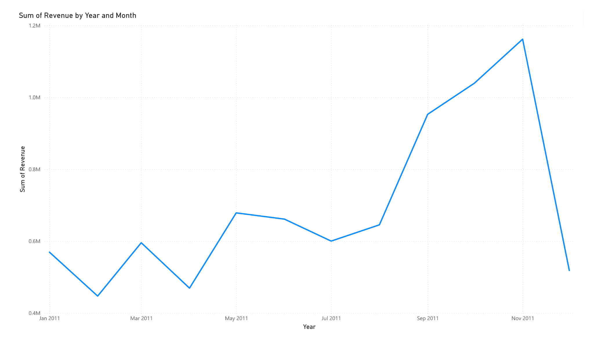
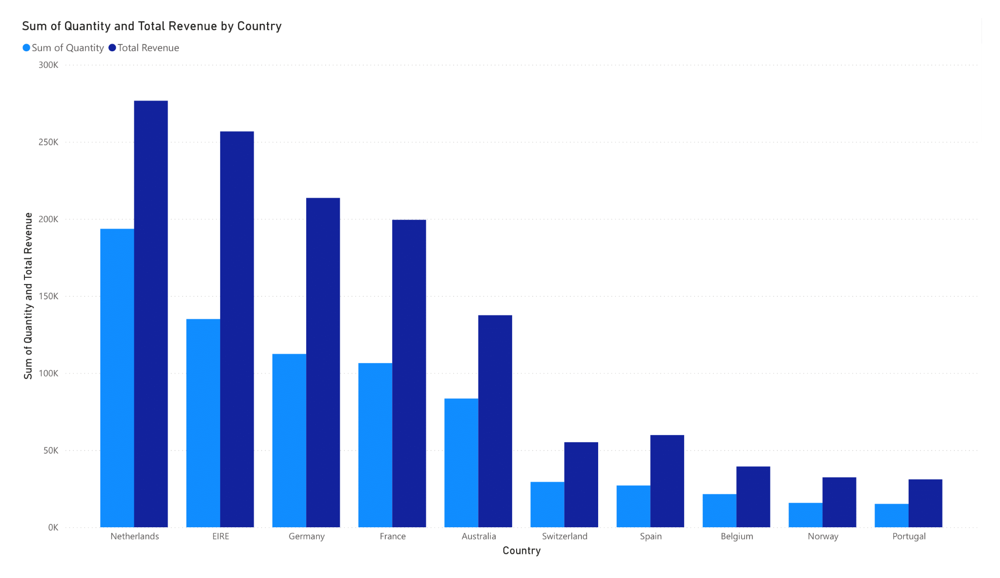
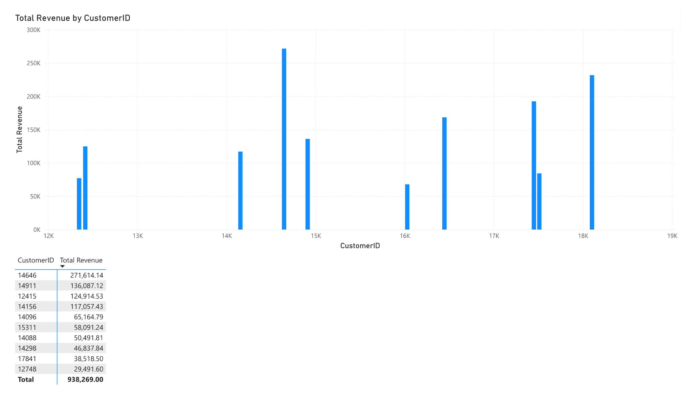
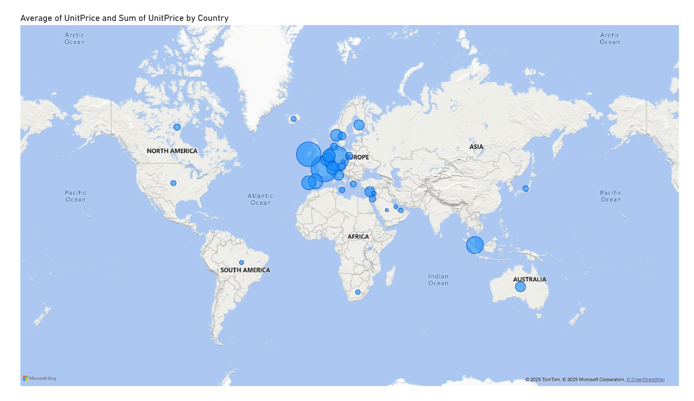
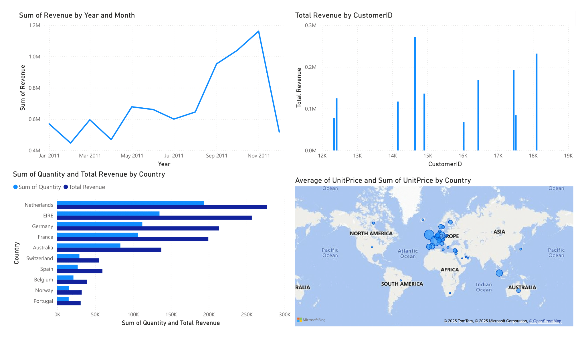

# Tata Data Visualisation Virtual Internship

This project was completed as part of the **Tata Data Visualisation: Empowering Business with Effective Insights** virtual internship on [Forage](https://www.theforage.com/).  
The work includes **interactive Power BI dashboards** and written documentation of problem-solving steps.

---

## 📊 Tools & Technologies
- **Power BI Desktop** – for interactive dashboards and data visualisations  
- **Microsoft Word** – for documenting tasks and solutions  
- **Excel/CSV** – as the dataset source  
- **DAX** – for custom calculations (e.g., revenue)  

---

## 📂 Dataset Overview
The dataset contains online retail transaction data, including:
- Invoice date & number  
- Product details (description, quantity, unit price)  
- Customer IDs  
- Country of purchase  

---

## 📝 Tasks & Solutions

### **Problem 1: Monthly Revenue Trends (2011)**
**Stakeholder:** CEO  
- Created a **line chart** showing monthly revenue for 2011.  
- Revenue calculated as: `Quantity × Unit Price`.  
- **Insight:** Revenue peaked in **November** and was lowest in **February**, revealing seasonal trends.  

---

### **Problem 2: Top 10 Countries by Revenue (Excluding UK)**
**Stakeholder:** CMO  
- Built a **side-by-side bar chart** comparing **Revenue** and **Quantity Sold**.  
- Filtered to **Top 10 countries** (excluding UK).  
- **Insight:** **Netherlands** ranked highest in both revenue and sales quantity.  

---

### **Problem 3: Top 10 Customers by Revenue**
**Stakeholder:** CMO  
- Designed a **vertical bar chart** ranking top customers by total revenue.  
- Sorted in **descending order** for clarity.  
- **Insight:** **Customer ID 14646** contributed the most revenue overall.  

---

### **Problem 4: Global Product Demand (Excluding UK)**
**Stakeholder:** CEO  
- Developed a **map chart** showing product demand (units sold) by country.  
- Removed UK data to focus on **expansion opportunities**.  
- **Insight:** Several non-UK countries show high demand potential for growth.  

---

## 📄 Documentation
The detailed thought process and step-by-step solutions are recorded in **[Tasks_and_Solutions.docx](Tasks_and_Solutions.docx)**.  
It includes:
- Problem statements from stakeholders  
- Visualisation approach  
- Insights and recommendations  

---

## 📊 Full Dashboard View
Below is the complete dashboard combining all four problem visuals into a single view for a quick business overview:

---

## 🚀 How to View the Power BI Dashboard
1. Download `tata virtual internship.pbix` from this repository.  
2. Open it in **Power BI Desktop** (free download from Microsoft).  
3. Interact with visuals and apply filters for deeper insights.

---

## 📚 Key Learnings
- Translating stakeholder requirements into actionable visuals  
- Applying **filters, sorting, and aggregation** in Power BI  
- Presenting insights for **strategic decision-making**  

---

### 📌 Acknowledgment
Virtual Internship completed via **Tata Group x Forage** program.
